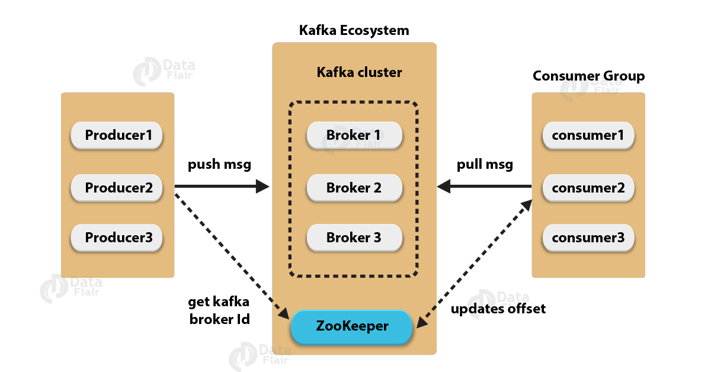

# The Goal
The PoC/spike is intended to:
- create a topic
- create a publisher to send a 'Message'
- create a subscriber to listen/receive a 'Message'

There are written some tests to probe that everything is working as it must.  

# Kafka Message System PoC
Apache Kafka is a distributed and fault-tolerant stream processing system.


Kafka Ecosystem:
- **_brokers_**: actors/agents inside of the message system. Handle the messages in partitions a many other tasks.
Receive and retrieve the messages to the clients: producer and consumer. Many brokers conform a cluster. 
Brokers are stateless, they don't know/care of the producer/consumer tracking.  
The idea behind the brokers is the same that the akka actors system.
- **_topics_**: are the buckets where the messages are going to be collected.
- **_partitions_**: the brokers handle partitions.
- **_producer_**: send messages to the message system
- **_consumer_**: pull the messages from the message system
- **_zookeeper_** coordinating system: allows coordinate all the broker nodes. 
Register the nodes and do the status tracking of them.

In order to create all the pieces of the puzzle, we can use the docker images already created in the docker repo.
So we are going to run the kafka docker image and the zookeeper image too.
To do we are going to follow the next steps.

workflow steps:
- run the zookeeper image
- run the kafka image
- create a broker or several
- create a topic and assign it to a broker or several brokers
- create a producer and write some messages to the topic using the prompt. click enter to send it.
- create a consumer and read some messages to the topic using the prompt.

you can host to scale and coordinate the kafka cluster and the zookeeper using kubernates. 
Let's say that kubernates is like a marathon/mesos tool to docker hosting.
You have to fill some yml files to deploy the docker images there.

## Spring + Kafka integration
Everything is integrated out the box. 
The only thing that you have to do is to create a producer/consumer client, using the spring templates provided for this thing. 
For testing is really easy, use the @EmbeddedKafka annotation in the test classes and Springboot will start everything 
what you need. That is: a zookeeper instance and a kafka instance. The kafka brokers are generated automatically.

## Kafka + Zookeeper dockerized, Hands on!

### Obtain the ip of the localhost
```bash
ifconfig
...
wlp4s0: flags=4163<UP,BROADCAST,RUNNING,MULTICAST>  mtu 1500
        inet 192.168.1.58  netmask 255.255.255.0  broadcast 192.168.1.255
```
In this case the ip is 192.168.1.58. This Ip will be used in the next sections.

### run zookeeper
```bash
docker run -d --name zookeeper -p 2181:2181 jplock/zookeeper
```

### run kafka
```bash
docker run -d --name kafka -p 7203:7203 -p 9092:9092 -e KAFKA_ADVERTISED_HOST_NAME=192.168.1.58 -e ZOOKEEPER_IP=192.168.1.58 ches/kafka
```
### Create topic
```bash
docker run \
--rm ches/kafka kafka-topics.sh \
--create \
--topic senz \
--replication-factor 1 \
--partitions 1 \
--zookeeper 192.168.1.58:2181
```

### List topics
```bash
docker run \
--rm ches/kafka kafka-topics.sh \
--list \
--zookeeper 192.168.1.58:2181
```

### Create publisher
```bash
docker run --rm --interactive \
ches/kafka kafka-console-producer.sh \
--topic senz \
--broker-list 192.168.1.58:9092
```
Write as many messages you wish in the console

### Create consumer
```bash
docker run --rm \
ches/kafka kafka-console-consumer.sh \
--topic senz \
--from-beginning \
--zookeeper 192.168.1.58:2181
```
You will receive the message in the console

### Go inside Zookeeper container
```bash
docker exec -it zookeeper bash
```

### Connect to Zookeeper server
```bash
bin/zkCli.sh -server 127.0.0.1:2181
```

### List root
```bash
ls /
```

###  List brokers
```bash
ls /brokers
```

### List topics
```bash
ls /brokers/topics
```

### List consumers
```bash
ls /consumers
```

### List consumer owner
```bash
ls /consumers/console-consumer-1532/owners
```

##  Dockerize the app
From the project root folder exec the commands to create a docker image and run it:

for macosx start the docker daemon
```bash
killall Docker && open /Applications/Docker.app
```

then execute the next commands in order to create the docker image and run it:
```bash
docker build -f docker/Dockerfile . -t friends
docker run -p 8080:8080 friends
```

to stop the application first we have to stop the docker process and then kill the docker process:
```bash
docker stop $(docker ps -a -q)
docker rm $(docker ps -a -q)
```

to clean the docker images from the system:
```bash
docker images
docker rmi PID
``` 

Once you have the dockerized app is really easy bring it to the cloud. You look for a cloud provider to deploy it and host it.

### References
- https://codenotfound.com/spring-kafka-boot-example.html
- https://www.tutorialspoint.com/apache_kafka/apache_kafka_introduction.htm
- https://medium.com/@itseranga/kafka-and-zookeeper-with-docker-65cff2c2c34f

### creating spring project from scratch
```bash
spring init --build gradle --name=project-name --dependencies=web,data-jpa,mysql,devtools,thymeleaf --package-name=com.amm.artifact projectName
```